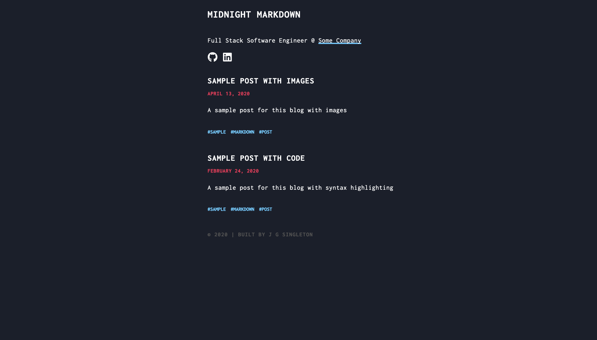

<h1 align="center">
  GATSBY MIDNIGHT MARKDOWN STARTER BLOG
</h1>

A gatsby starter blog with MDX, Preact and Prism.

## Demo

https://tender-meninsky-4a0db3.netlify.app/

## Screens

Home Screen



Blog Post


## 🚀 Quick start

1.  **Create a Gatsby site.**

    Use the Gatsby CLI to create a new site, specifying the blog starter.

    ```shell
    # create a new Gatsby site using the blog starter
    gatsby new my-blog-starter https://github.com/JesseSingleton/gatsby-starter-midnight-markdown
    ```

1.  **Start developing.**

    Navigate into your new site’s directory and start it up.

    ```shell
    cd my-blog-starter/
    gatsby develop
    ```

1.  **Open the source code and start editing!**

    Your site is now running at `http://localhost:8000`!

    _Note: You'll also see a second link: _`http://localhost:8000/___graphql`_. This is a tool you can use to experiment with querying your data. Learn more about using this tool in the [Gatsby tutorial](https://www.gatsbyjs.org/tutorial/part-five/#introducing-graphiql)._

    Open the `my-blog-starter` directory in your code editor of choice and edit `src/pages/index.js`. Save your changes and the browser will update in real time!

## 🧐 What's inside?

A quick look at the top-level files and directories you'll see in a Gatsby project.

    .
    ├── content
    ├── node_modules
    ├── src
    ├── .eslintrc
    ├── .gitignore
    ├── .prettierignore
    ├── .prettierrc
    ├── gatsby-browser.js
    ├── gatsby-config.js
    ├── gatsby-node.js
    ├── LICENSE
    ├── package.json
    ├── README.md
    └── yarn.lock

This starter is very similar to the default starter with some key changes:

1.  **`/content`**: This directory contains all of the markdown files that are used to generate blog posts for your site. To add a new blog post, create a folder under **`/content/blog`** and add a markdown file named `index.mdx`. For example creating a folder named `my-test-post` will create a new blog post at `https://mysite.com/my-test-post` and render the content in the `index.mdx`.

2.  **`yarn.lock`**: The lock file created by [yarn](https://yarnpkg.com/). This contains information about the versions and package dependancies required to build this project. If you wish to use npm, delete this and run `npm install`.

## 🎓 Learning Gatsby

Looking for more guidance? Full documentation for Gatsby lives [on the website](https://www.gatsbyjs.org/). Here are some places to start:

- **For most developers, we recommend starting with our [in-depth tutorial for creating a site with Gatsby](https://www.gatsbyjs.org/tutorial/).** It starts with zero assumptions about your level of ability and walks through every step of the process.

- **To dive straight into code samples, head [to our documentation](https://www.gatsbyjs.org/docs/).** In particular, check out the _Guides_, _API Reference_, and _Advanced Tutorials_ sections in the sidebar.

## 💫 Deploy

[](https://app.netlify.com/start/deploy?repository=https://github.com/JesseSingleton/gatsby-starter-midnight-markdown)

## 💫 Powered By

<div>
  <a marginRight="10px" href="https://www.gatsbyjs.org">
    
  </a>
</div>
